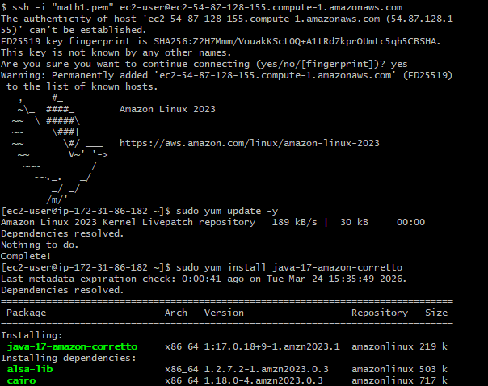
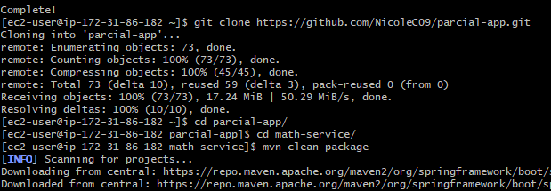
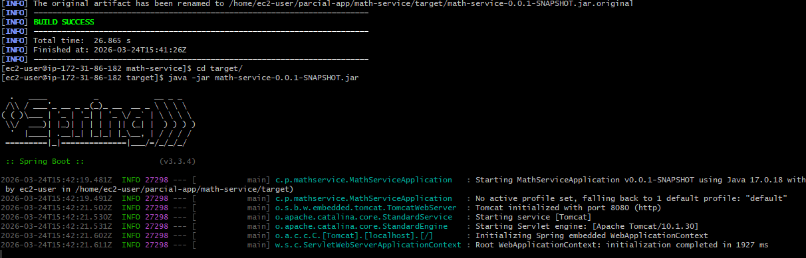
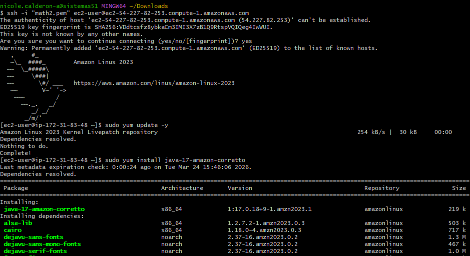
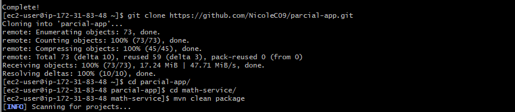
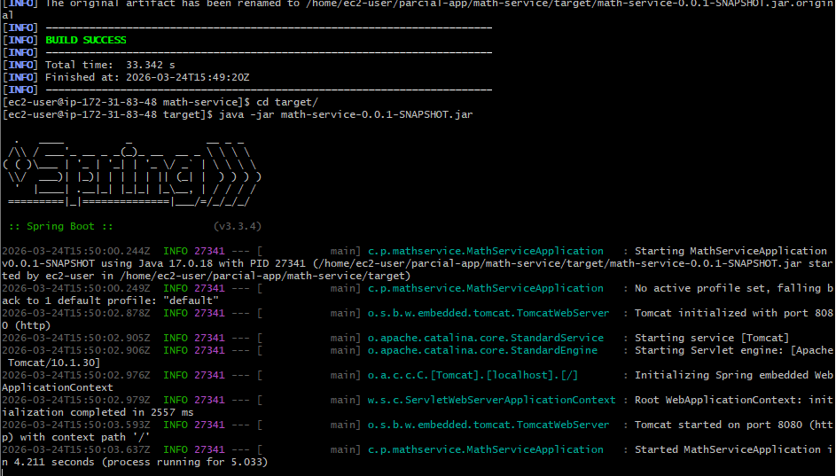
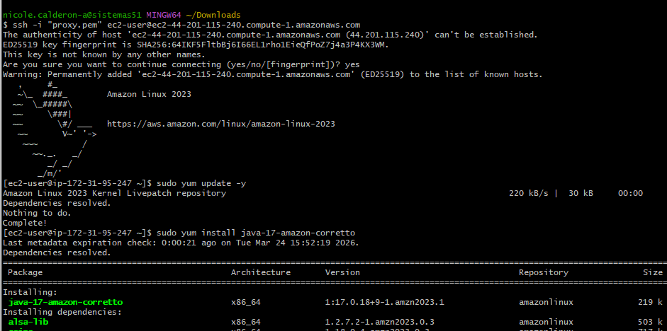
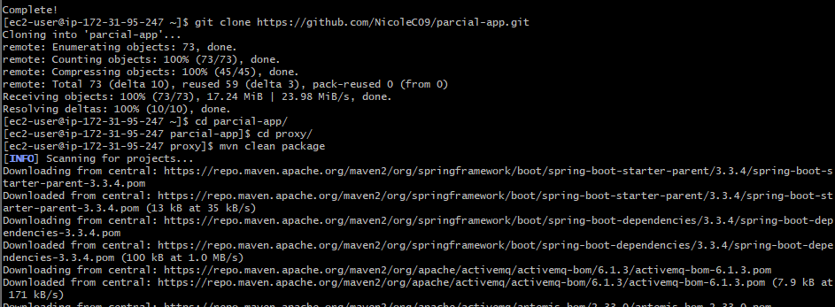
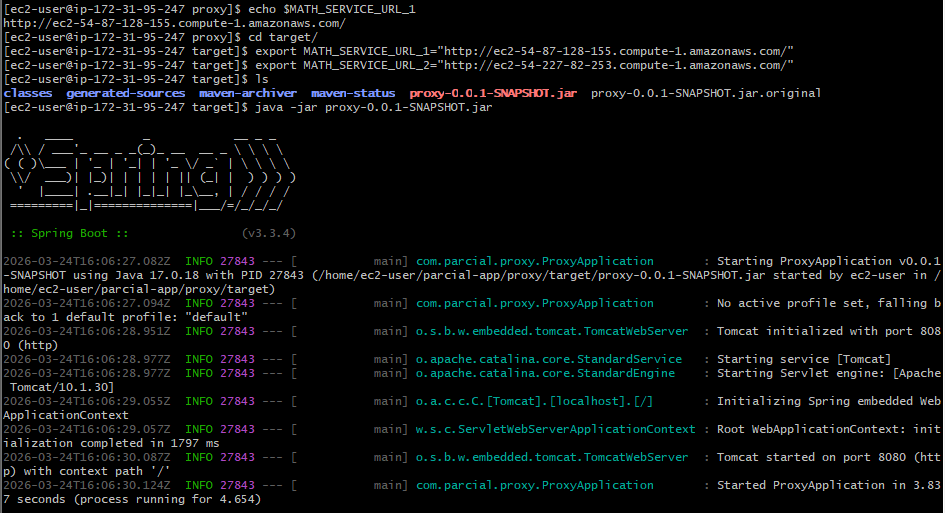
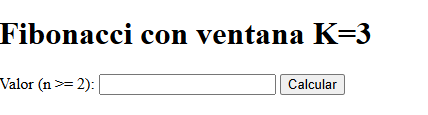

# Servicio Matemático con Proxy

** Autor: ** Nicole Dayan Calderón Arévalo
** Materia: ** Transformación Digital y Soluciones Empresariales
** Universidad: ** Escuela Colombiana de Ingeniería Julio Garavito

## Problema
Diseñe un prototipo de sistema de microservicios que tenga un servicio (En la figura se representa con el nombre Math Services) para computar las funciones numéricas.  El servicio de las funciones numéricas debe estar desplegado en al menos dos instancias virtuales de EC2. Adicionalmente, debe implementar un service proxy que reciba las solicitudes de llamado desde los clientes  y se las delegue a las dos instancias del servicio numérico usando un algoritmo de round-robin. El proxy deberá estar desplegado en otra máquina EC2. Asegúrese de poder configurar las direcciones y puertos de las instancias del servicio en el proxy usando variables de entorno del sistema operativo.  Finalmente, construya un cliente Web mínimo con un formulario que reciba el valor y de manera asíncrona invoke el servicio en el PROXY. Puede hacer un formulario para cada una de las funciones. El cliente debe ser escrito en HTML y JS.

 

### Problema matemático

Fibonacci con ventana (suma móvil K=3)
Su servicio matemático debe incluir una función:

fibwin(n) retorna un JSON con la serie de Fibonacci desde F_0 hasta F_n y la suma móvil de ventana K=3 aplicada a esa serie. (Recibe enteros n ≥ 2).
Definición
Fibonacci: F_0=0, F_1=1, F_n=F_{n-1}+F_{n-2} para n ≥ 2.
Ventana K=3: para la lista [a0, a1, …, am], la suma móvil es [a0+a1+a2, a1+a2+a3, …].

## Estructura
- client
--> app.js
--> index.html
- math-service
- proxy
-  README

## Descripción Solución
En base al problema propuesta se propone una solución iterativa de fibonacci en el servicio matemático.

## Instrucciones para desplegar en EC2

1. Se crean 2 instancias para "math-service" y 1 instancia para el proxy 

2. Se conecta desde donde se encuentren las keys de las instancias a las intancias utilizando:
´´ ssh -i nombre-key.pem ec2-user@IP_INSTANCIA´´

3. Instale Java, Maven y Git con:
´´ sudo yum install ...´´

4. Luego clone el repositorio:
´´git clone https://github.com/NicoleC09/parcial-app.git´´

5. Ingrese uno a uno primero math y luego proxy y haga ´´mvn clean package´´

6. Ejecute el jar generado con:
´´java -jar nombredeljar.jar´´

## Evidencia despliegue en EC2

Math Server 1

Math Server 2

Proxy

